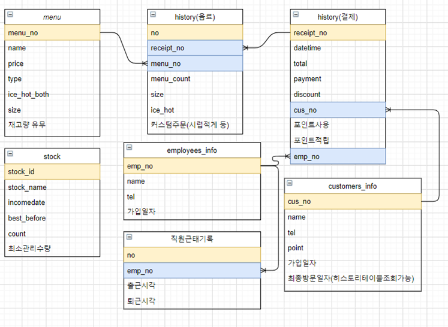
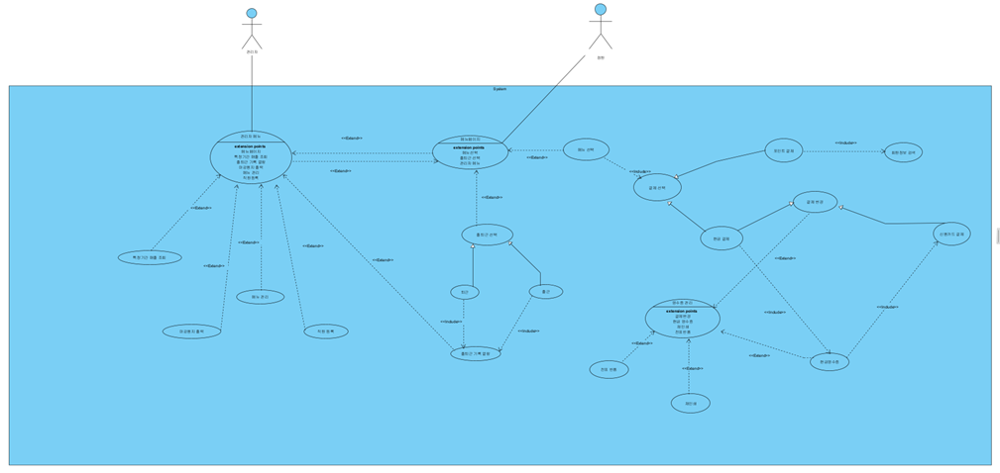
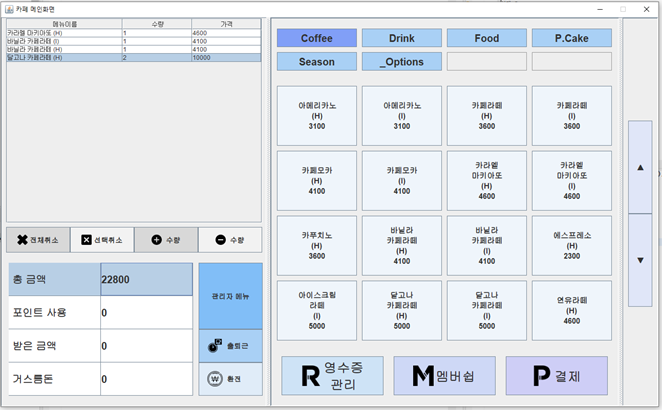

# CafePos : 카페 포스기

---

카페 매장에서 점원이 주문 받을때 이용하는 기기 시스템인 ‘카페 포스기’를 개발주제로 정했습니다. 내용은 물품관리, 계산, 영수증 기능으로 구현되어 있습니다.

시연 영상 : https://www.youtube.com/watch?v=2ZCkWeSHB5U&list=PLvceeUENoEJP_KDwIU3bKnQCo1vHEihRP&index=2&t=9s

## 브랜치 전략

----

1.  처음에는 git-flow같은 전략들이 있는 것을 인지하지 못하여 feature브랜치를 만들때 브랜치명을 구체적으로 짓지 못한 부분이 있지만 기능에 따라 브랜치를 구분지었습니다. 그리고 어느정도 완성이 되면 develop브랜치로 각 기능들을 merge해보는 경험도 했습니다.

2. 팀원끼리 작업을 한참 진행 후에 커밋메시지의 내용을 파악하기 어려움을 느끼고 메시지의 규칙을 정했습니다. 커밋메시지의 규칙은 '[닉네임]수정파일/ 작업 내용'과 같은 방식으로 작성하기로 했습니다.

## 사용된 기술

---

1. DB
   + 오라클 DB
2. 백엔드 
   + JAVA언어
   + OJDBC를 이용해서 DB연결

3. 프론트엔드
   + JAVA에서 제공하는 Swing

## ER 다이어그램

------

  

 

## 유스케이스 다이어그램

----

 

## 내가 맡은(김종윤) 개발 내용.

-----

### (1). 메뉴 선택 / 취소

 

+ '분류'에 해당 하는 버튼을 누르면 해당 분류의 음식의 메뉴들로 오른쪽버튼이 구성된다. 그리고 그 메뉴를 누르면 왼쪽 계산테이블에 열로 추가 된다.

+ 추가된 메뉴를 선택한 후 '선택취소'가 가능하고, '전체취소'도 가능하다.

+ 메뉴를 선택 후 수동적으로 수량 증감을 조정할 수 있다.

### (2). 회원/ 비회원 결제

 

+ 회원일 경우, 멤버쉽 조회를 진행해서 소유한 포인트를 소비하여 결제를 진행할 수 있다.
+ 결제를 할때에 현금, 카드를 나눠서 부분결제도 가능하고 동시에 결제하는 것도 가능하다.

